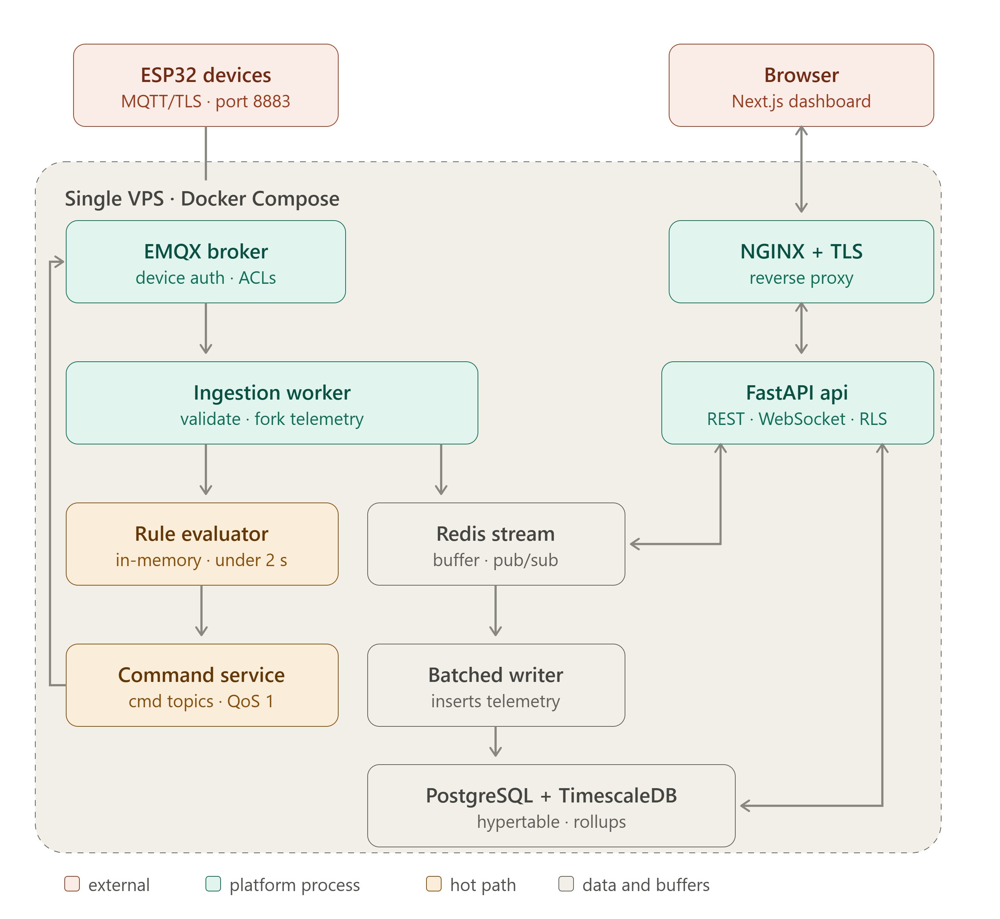

# Implementation decisions

Non-obvious choices made while building the backend, with the reason for each. They are still true
in the code. This file collects them from the phase reports (Phases 1–3), which were removed once
their deliverables shipped. Architectural decisions (stack, split hot/storage path, Redis instead of
Kafka, RLS) are in `CLAUDE.md` §3; rule semantics are in `docs/rule-engine-multi-device.md`.

## Data and isolation

**`telemetry` has no Row-Level Security**, unlike every other tenant-scoped table.
- **Why:** TimescaleDB compression and RLS can't coexist on the same hypertable
  (`FeatureNotSupportedError: compression cannot be used on table with row security`;
  timescale/timescaledb#6827, #7830; the security-barrier-view workaround is blocked by the same
  restriction, #6425). Compression was chosen, because uncompressed telemetry is the biggest storage
  cost risk.
- **Instead:** tenant isolation for telemetry is enforced in the application. Every query in
  `telemetry/service.py` filters explicitly by `tenant_id`. See that module's docstring and the
  `create_telemetry_hypertable` migration.

**Lookups without a tenant use SECURITY DEFINER functions**, never a superuser connection.
- **Why:** EMQX's auth callback, the HTTP ingest fallback and the worker's rule cache have to find
  rows *before* a tenant is known (checking a device's credential is how its tenant is discovered),
  while RLS tables fail closed with no tenant context.
- **How:** `lookup_device_for_auth` / `lookup_device_by_slug` (the `add_device_auth_lookup_functions`
  migration) and `list_enabled_rules()` (`add_rule_cache_lookup_function`) are the narrow, auditable
  exceptions:
  - owned by the migration role, so they bypass RLS internally
  - granted `EXECUTE`-only to `iot_app`
  - return only the columns their caller needs

  Everything else stays fully RLS-protected.

**The MQTT username is `device.id`, not `device.slug`.**
- **Why:** a slug is unique only per tenant, so it's ambiguous at CONNECT time, when there is no
  tenant context.
- **Topics still use the slug,** which keeps them human-readable.

## Transactions and the hot path

**Side effects that another process must see run after commit:**
`db.add_post_commit_callback(session, callback)`.
- **Why:** publishing the rule-invalidation message inside the open transaction let the worker
  reload before the commit and see zero rules.
- **How:** callbacks registered this way run only after `get_session()` commits successfully. Rule
  invalidation, emails and any other "only once it's really saved" work use it.

**The evaluator mutates `RuleState` in place, deliberately.**
- "Pure" in the `Evaluator` protocol (CLAUDE.md §5) means no I/O and no awaits. It doesn't mean
  strict immutability.
- Mutating the caller's own state object is how hold time, hysteresis and cooldown are tracked, and
  it is just as easy to test exhaustively.

**Measured breach → command latency: 118.6 ms** on a single host. This was the Phase 3 acceptance
test: a simulated sensor publish to an actuator command observed on the broker, against the
under-2 s requirement.
